# GitIntel

[](https://github.com/gitintel-ai/GitIntelAI/actions)
[](LICENSE)
[](packages/cli/Cargo.toml)
[](https://www.rust-lang.org)
[](https://github.com/gitintel-ai/GitIntelAI)

> Do you know how much of your codebase is AI-generated?

GitIntel tracks AI authorship in your git history -- line by line, commit by commit.
**The missing `git blame` for AI code.**

<p align="center">
  
</p>

## The Problem

Engineering teams use Claude Code, Cursor, and Copilot daily. But nobody can answer:

- What percentage of our code is AI-written?
- What does AI coding actually cost per sprint?
- Which developers and agents produce the most code?

GitIntel answers all three. Zero workflow change. 100% local.

## Install

```bash
# macOS / Linux
curl -fsSL https://gitintel.com/install | sh

# Homebrew
brew install gitintel-ai/tap/gitintel

# Windows (PowerShell)
irm https://gitintel.com/install.ps1 | iex

# npm (any platform)
npx @gitintel-cli/gitintel
```

<details>
<summary>Build from source</summary>

```bash
git clone https://github.com/gitintel-ai/GitIntelAI.git && cd GitIntelAI
cargo build --release --manifest-path packages/cli/Cargo.toml
cp packages/cli/target/release/gitintel ~/.local/bin/
```

Requires Rust 1.82+ ([rustup.rs](https://rustup.rs)) and Git 2.30+.
</details>

## Quick Start

```bash
cd your-project/
gitintel init          # install hooks, create local DB
gitintel checkpoint \
  --file "src/api.ts" \
  --lines "12-45,78-103"   # --agent and --model are optional
git commit -m "Add auth flow"   # hook fires, attribution recorded
gitintel stats --since 30d      # see the numbers
```

## Zero-Setup Mode

Works on **any** repo. No init required. Detects `Co-Authored-By` trailers and AI agent signatures automatically:

```bash
gitintel scan
```

```
Scanning git history...
  Found 47 commits with AI co-author trailers
  Agents detected: Claude Code (31), Cursor (12), Copilot (4)

AI Adoption: 38.2% of commits  |  ~4,200 lines attributed
```

## gitintel blame

Like `git blame`, but shows who (or what) wrote each line:

```bash
gitintel blame src/api.ts
```

```
AI Blame: src/api.ts
   1 [AI] dc69ba8  Alice Chen  export async function createUser(
   2 [AI] dc69ba8  Alice Chen    data: CreateUserInput,
   3 [AI] dc69ba8  Alice Chen  ) {
  ...
  55 [AI] dc69ba8  Alice Chen  }
  56 [HU] dc69ba8  Alice Chen  // Hand-written validation
  57 [HU] dc69ba8  Alice Chen  function validateEmail(email: string) {
  58 [HU] dc69ba8  Alice Chen    return EMAIL_RE.test(email);
  59 [HU] dc69ba8  Alice Chen  }
```

`[AI]` AI-generated (checkpoint) | `[AI*]` AI-detected (Co-Authored-By) | `[HU]` Human-written | `[MX]` Mixed | `[??]` Unknown

## gitintel cost

```bash
gitintel cost --since 7d
```

```
Cost Summary: last 7d
------------------------------------------------------
Total Spend:     $47.23
Commits:         142
Avg Cost/Commit: $0.33
AI Code Lines:   7,923 / 18,340 (43.2%)
------------------------------------------------------
By Developer:
  alice@acme.com     $18.40  (38 commits, 61.0% AI)
  bob@acme.com       $14.72  (52 commits, 34.5% AI)
  carol@acme.com     $14.11  (52 commits, 40.1% AI)
```

## How It Works

```
┌──────────────┐     ┌──────────────────┐     ┌─────────────────────────┐
│  AI Agent    │     │  GitIntel CLI     │     │  Git Repository         │
│ Claude Code  │────▶│  (Rust binary)    │────▶│                         │
│ Cursor       │     │                  │     │  refs/ai/authorship/    │
│ Copilot      │     │  ┌────────────┐  │     │    └── <commit-sha>    │
│ Any agent    │     │  │ SQLite DB  │  │     │        (YAML log)      │
│              │     │  └────────────┘  │     │                         │
└──────────────┘     └──────────────────┘     └─────────────────────────┘
  PostToolUse hook     checkpoint → commit       open standard, travels
  Co-Authored-By       hook → attribution        with push/fetch/clone
```

1. You `git commit` as normal -- no workflow change
2. GitIntel's post-commit hook reads pending checkpoints from a local SQLite DB
3. It computes AI vs human line attribution and stores a YAML record in `refs/ai/authorship/<sha>`
4. That ref is a **standard git ref** -- it travels with `git push`, survives clones, and is readable with plain `git notes` even without GitIntel installed

```bash
# Read attribution without gitintel:
git notes --ref=refs/ai/authorship show HEAD
```

No cloud. No vendor lock-in. Your attribution data lives in the repo itself.

## Why GitIntel vs Alternatives

<!-- Verified 2026-03-29. Sources: usegitai.com, agent-trace.dev, archipelo.com -->

| | GitIntel | git-ai | Agent Trace | Manual |
|---|:---:|:---:|:---:|:---:|
| Works offline | Yes | Yes | N/A (spec) | Yes |
| Open standard (git refs) | `refs/ai/authorship` | Git Notes | JSON trace records | No |
| All agents supported | Yes (any) | Yes (12+) | Spec-level | N/A |
| Self-hostable | Yes | Yes | N/A | N/A |
| Line-level attribution | Yes | Yes | Spec-level | No |
| Cost tracking ($/commit) | Yes | No | No | No |
| Survives rebase/cherry-pick | No | Yes | Unresolved | No |
| Standalone tool | Yes | Yes | No (spec only) | N/A |
| Open source | MIT | Apache 2.0 | CC BY 4.0 | N/A |

**git-ai** ([usegitai.com](https://usegitai.com)) — open-source CLI (1.4k stars) with IDE extensions for VS Code, Cursor, Windsurf. Agent-reported hooks, `ai blame`, `/ask` to query the original AI about code it wrote.

**Agent Trace** ([agent-trace.dev](https://agent-trace.dev)) — open specification (v0.1.0 RFC) by Cursor & Cognition AI, backed by Cloudflare, Vercel, Google Jules, Amp. Defines a JSON format for attribution metadata. git-ai implements this spec.

## Supported Agents

GitIntel is vendor-agnostic. `--agent` is a free-form string -- any agent works:

- **Claude Code** -- auto-checkpoint via PostToolUse hooks
- **Cursor** -- Co-Authored-By detection via `gitintel scan`
- **GitHub Copilot** -- VS Code extension (planned)
- **OpenAI Codex** -- manual checkpoint
- **Gemini Code Assist** -- manual checkpoint
- **Amazon Q Developer** -- manual checkpoint
- **Windsurf / Codeium** -- manual checkpoint
- **Any custom agent** -- just pass `--agent "your-agent"`

## Release Scope (v0.1.0-beta)

| Surface | Status | Notes |
|---------|--------|-------|
| `gitintel` CLI (Rust) | **GA** | Fully tested, stable CLI surface, semver-guaranteed from this release |
| `refs/ai/authorship/*` format | **GA** | Stable schema — readable without the CLI, forward-compatible |
| `@gitintel/core` package | Preview | Shared types — API may shift through 0.2 |
| Dashboard (Next.js) | Preview | Functional but light on tests — use at your own pace |
| Server (Bun + Hono) | Preview | SCIM / RBAC / audit are implemented but not load-tested |

The CLI is the product. The server and dashboard are optional team-rollup surfaces that ride alongside — if you just want the CLI, ignore everything in `packages/server` and `packages/dashboard`.

## Enterprise (Preview)

GitIntel includes early-stage self-hosted components for teams: Docker Compose + Kubernetes (Helm), SAML/OIDC SSO, SCIM 2.0, RBAC with 5 roles, audit log, air-gapped deployment, and SOC2/ISO 27001 report export. These ship in the monorepo as **Preview** — functional against the reference deployment but not yet through a production load test. Run them in a staging environment first.

## Roadmap

- [x] Rust CLI with local SQLite storage
- [x] Line-level AI/Human attribution
- [x] Cost tracking per commit, developer, sprint
- [x] `gitintel blame` with `[AI]`/`[HU]`/`[AI*]` markers
- [x] `gitintel scan` — zero-setup Co-Authored-By detection
- [x] Enterprise SSO, SCIM, RBAC, audit log
- [x] CLAUDE.md context optimizer
- [ ] Pre-built binaries (Linux, macOS, Windows)
- [ ] One-liner install script
- [ ] Homebrew tap
- [ ] Auto-attribution via IDE hooks (Cursor, Copilot)
- [ ] VS Code extension for Copilot
- [ ] Hosted SaaS at app.gitintel.com
- [ ] PR cost annotations (GitHub App, GitLab)
- [ ] Budget forecasting and anomaly detection
- [ ] MCP server for agent-readable attribution

## Contributing

See [CONTRIBUTING.md](CONTRIBUTING.md) for guidelines on how to contribute.

## License

MIT -- see [LICENSE](LICENSE).

## Star History

<a href="https://star-history.com/#gitintel-ai/GitIntelAI&Date">
 <picture>
   <source media="(prefers-color-scheme: dark)" srcset="https://api.star-history.com/svg?repos=gitintel-ai/GitIntelAI&type=Date&theme=dark" />
   <source media="(prefers-color-scheme: light)" srcset="https://api.star-history.com/svg?repos=gitintel-ai/GitIntelAI&type=Date" />
   
 </picture>
</a>

---

<p align="center">
  <a href="https://gitintel.com">gitintel.com</a> &middot;
  <a href="docs/">Docs</a> &middot;
  <a href="https://github.com/gitintel-ai/GitIntelAI/issues">Issues</a>
</p>
